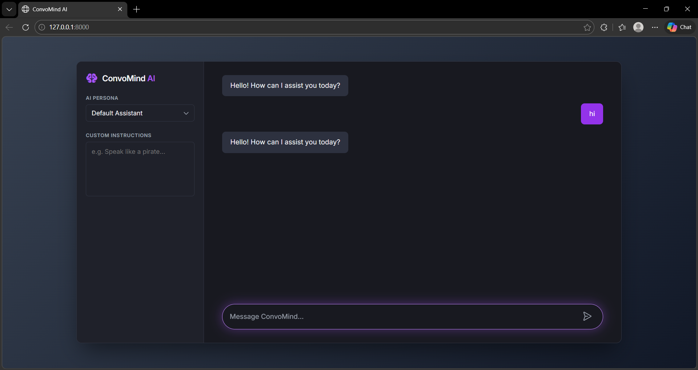

# ConvoMind AI 🤖


ConvoMind AI is a modern, responsive, and highly interactive AI chatbot application built with Django and powered by AI via the OpenRouter API. It features a premium dark-mode SaaS aesthetic, customizable AI personas, and smooth message handling.

---

## 📸 Screenshots

 Main Chat Interface 
 <br>
 

---

## ✨ Features

- **Premium UI/UX:** Sleek dark-mode design, centered floating interface, and modern typography (using the Inter font).
- **Customizable AI Roles:** Choose from pre-configured personas (Storyteller, Professor, Travel Guide, Tech Architect) or write your own custom system instructions on the fly.
- **Responsive Layout:** Beautiful pill-shaped inputs, glowing focus states, and seamless mobile scaling.
- **Secure Backend:** A Django-powered Python backend acting as a secure proxy to the AI API, completely hiding and protecting your API keys from the frontend client.
- **Production-Ready:** Configured for seamless deployment on Render with WhiteNoise static file serving and PostgreSQL database support.

---

## 🚀 Getting Started (Local Development)

Follow these steps to set up the project locally on your machine.

### Prerequisites
- Python 3.8+
- Git

### Installation

1. **Clone the repository:**
   ```bash
   git clone https://github.com/Praveen869/convoMind.git
   cd convoMind
   ```

2. **Create and activate a virtual environment:**
   ```bash
   # On Windows
   python -m venv venv
   venv\Scripts\activate

   # On macOS/Linux
   python3 -m venv venv
   source venv/bin/activate
   ```

3. **Install the required dependencies:**
   ```bash
   pip install -r requirements.txt
   ```

4. **Configure your Environment Variables:**
   Create a new file named `.env` in the root directory (alongside `manage.py`) and add the following keys:
   ```env
   OPENROUTER_API_KEY="your_openrouter_api_key_here"
   SECRET_KEY="your_secure_django_secret_key"
   DEBUG=True
   ```

5. **Apply Database Migrations:**
   *(The local SQLite database is git-ignored, so you'll need to create a fresh one.)*
   ```bash
   python manage.py migrate
   ```

6. **Start the Development Server:**
   ```bash
   python manage.py runserver
   ```

   **That's it!** Open your browser and navigate to `http://127.0.0.1:8000` to start chatting!

---

## ☁️ Deploying to Render

This project is pre-configured for one-click deployment to [Render.com](https://render.com).

### Steps

1. **Push your code** to a GitHub repository.
2. On Render, create a **PostgreSQL** database and copy its **Internal Database URL**.
3. Create a new **Web Service** and connect your GitHub repository.
4. Use these settings:
   - **Build Command:** `./build.sh`
   - **Start Command:** `gunicorn chatbot.wsgi:application`
5. Add the following **Environment Variables** in the Render dashboard:

| Variable | Value |
| :--- | :--- |
| `SECRET_KEY` | A long, random secret string |
| `DEBUG` | `False` |
| `OPENROUTER_API_KEY` | Your OpenRouter API key |
| `DATABASE_URL` | Internal Database URL from your Render PostgreSQL instance |
| `ALLOWED_HOSTS` | `your-app-name.onrender.com` |

Click **Create Web Service** — Render will automatically build and deploy your app!

---

## 🛠️ Technology Stack

| Layer | Technology |
| :--- | :--- |
| **Frontend** | HTML5, Vanilla CSS3, JavaScript, [Phosphor Icons](https://phosphoricons.com/) |
| **Backend** | Python, Django |
| **AI Integration** | [OpenRouter API](https://openrouter.ai/) |
| **Production Server** | Gunicorn |
| **Static Files** | WhiteNoise |
| **Database** | SQLite (local) / PostgreSQL (production) |
| **Hosting** | Render |

---

## 🤝 Contributing

Contributions, issues, and feature requests are welcome! Feel free to open an issue or submit a pull request.

## 📝 License

This project is licensed under the MIT License — see the [LICENSE](LICENSE) file for details.
